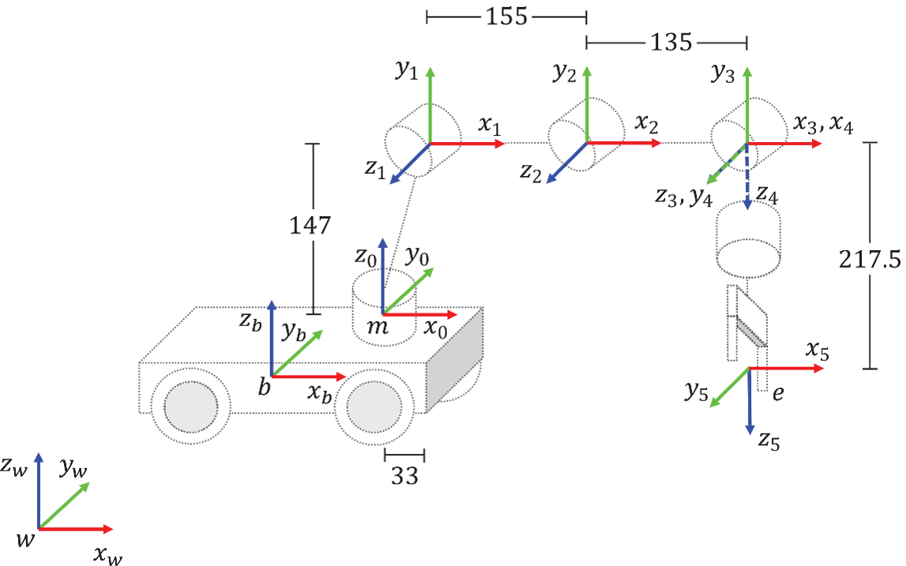
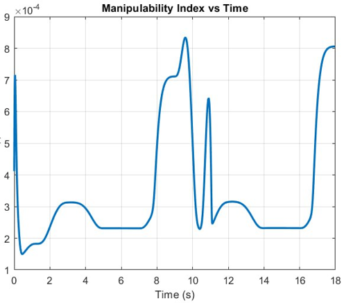
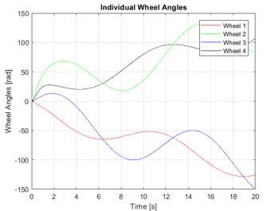
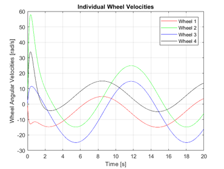

# KUKA youBot Mobile Manipulator Simulation Framework

🚀 A complete simulation framework for the **KUKA youBot mobile manipulator**, featuring an omnidirectional mecanum base, 5-DOF robotic arm, observer-based state feedback control, and multi-environment integration using ROS Noetic, MATLAB, and CoppeliaSim.

---

## 📌 Project Overview

This project provides a full simulation environment for a mobile manipulator system capable of precise **pick-and-place operations** in static environments. The framework integrates **modeling, control, and visualization** across multiple platforms to ensure realistic performance and scalability for industrial and research applications.

---

## 📦 Project Structure

- `matlab/` : Core control, kinematics, and dynamics scripts. Entry point: `MobileManipulatorMain.m`.
- `Coppeliasim Scenes/` : `.ttt` scene files for 3D simulation in CoppeliaSim.
- `csv files/` : Example motion and control data for analysis and replay.
- `docs/` : Project documentation and final report (PDF).
- `media/` : Images and videos for documentation and demonstration.
- `ros/kuka_youbot` : ROS Noetic package (URDF/Xacro, launch, nodes).

---

## ⚙️ Features

- 🟡 **Mecanum-wheeled base** for omnidirectional navigation
- 🟡 **5-DOF robotic arm** for accurate end-effector control
- 🟡 **Observer-Based State Feedback Control** for trajectory tracking
- 🟡 **Simulation & Visualization** in:
  - [ROS Noetic (RViz)](http://wiki.ros.org/noetic)
  - [MATLAB](https://www.mathworks.com/products/matlab.html)
  - [CoppeliaSim](https://www.coppeliarobotics.com/)
- 🟡 **Accurate CAD modeling** in CATIA V5 → translated into URDF/Xacro for ROS

---

## 🚦 Usage Instructions

### 1. MATLAB Simulation

- Open MATLAB and navigate to the `matlab/` folder.
- Run `MobileManipulatorMain.m` to start the full simulation.
- Optional: Run additional scripts such as `ArmPolePlacementandObserver.m` to simulate only the arm control.

### 2. CoppeliaSim Visualization

- Open CoppeliaSim.
- Load the scene file `Coppeliasim_Scenes/Scene6_youBot_cube.ttt`.
- Ensure the robot parameters match MATLAB for consistent simulation.

### 3. Data Analysis

- CSV files in `csv_files/` contain motion and control data.
- MATLAB scripts can read and process these files for analysis or replay.

### 4. ROS Noetic Integration

#### 4.1. Navigate to the ROS package:

```bash
cd ros/kuka_youbot
```

#### 4.2. Build your ROS workspace (if not built yet):

```bash
cd ~/your_workspace_name
catkin_make
source devel/setup.bash
```

#### 4.3. Launch the full robot system:

```bash
roslaunch kuka_youbot full_robot.launch
```

#### Key Launch Components

- `robot_description`: Loads full URDF/Xacro model combining arm + mobile base.
- `robot_state_publisher`: Publishes all TF transforms.
- `joint_state_publisher_gui`: GUI for manual joint testing.
- `rviz`: Visualization using robot2.rviz config (shows robot, TF frames, markers, trajectory).
- `end_effector_pose.py`: Publishes 3D end-effector position using TF.
- `marker.py`: Visualizes gripper position in RViz.
- `path.py`: Updates end-effector trajectory in RViz.
- `rqt_graph`: Shows live node-topic communication.

---

## 📷 Media

All images and videos are stored in `media/`. Below is a description and usage of each:

### DH Frame Assignment

  
_DH frame assignment for all robotic arm joints._

### Manipulability Index

  
_Manipulability analysis for full mobile manipulator._

<!-- ### Mobile Base Path


_Path trajectory of the mobile base._ -->
<!--
### Individual Wheel Angles

_Steering angles of each mecanum wheel during motion._

### Individual Wheel Velocities

_Wheel velocities plotted over time._

### Mobile Base State Trajectories


_State variables of mobile base over time._ -->

### Individual Wheel Angles vs Velocities

<p float="left">
  
  
</p>

### Full Robot Image

  
_Full robot visualization combining arm and mobile base._

### End-Effector Twist Evolution

  
_End-effector twist over time in body frame._

### Fully Assembled Robot

  
_Fully assembled robot visualization in ROS._

### ROS Graph

  
_ROS rqt_graph showing node and topic connections._

---
